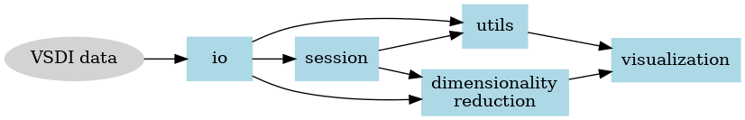

.. VSDI Pipeline documentation master file, created by
   sphinx-quickstart on Mon Jun 12 21:54:34 2023.
   You can adapt this file completely to your liking, but it should at least
   contain the root `toctree` directive.

VSDI Pipeline
=========================================

Package for handling voltage sensitive dye imaging data

.. toctree::
   :maxdepth: 1
   :caption: Code Documentation

   vsdi.io
   vsdi.dim_reduction
   vsdi.embeddings
   vsdi.utils
   vsdi.VAE
   vsdi.visualization
